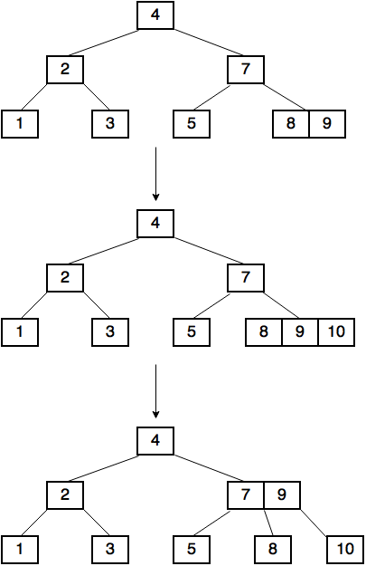

# B-Tree

B-树是节点个数可以大于2的自平衡搜索树

## 性质

一棵n阶的B树有以下性质：

- 每一个节点最多有2n个键[^注1]（key）
- 每一个节点（除根节点外）至少有n个键
- 一个有k个键的非叶子节点k+1个孩子
- 节点中所有的键值以从小到大的顺序排序
- 两个非叶子节点中的键K和I之间的子树涵盖了K和I之间的所有键
- 所有的叶子节点都在同一高度

一个2阶的键值范围为[1, 20]的B-Tree如下所示：


### B-Tree节点结构

```Swift
class BTreeNode<Key: Comparable, Value> {
  unowned var owner: BTree<Key, Value>
  
  fileprivate var keys = [Key]()
  var children: [BTreeNode]?
  
  ...
}
```

节点最重要是两个数组

- 一个包含节点所有键的数组
- 一个包含节点所有值的数组


为了知道B-树的阶，节点还必须有一个指向它的拥有者的索引。

注：子节点的数组是`Optional`类型数值，因为一个节点可能没有子节点。


### 搜索

1. 从根节点开始搜索值键的值为`k` 的键
2. 我们用线性查找的方式在节点中寻找到第一个不小于k的键`l`；或者我们到了数组的末端
3. 如果`k == l`那么我们找到该键
4. 否则，如果`k < l`
   - 如果当前节点不是叶子节点，那么转向`l`的左节点，并重复步骤3-5
   - 如果当前节点是叶子节点，那么`k`不在B-树中
5. 如果我们到达了数组的末端
   - 如果当前节点为非叶子节点上，那么转向节点的最后一个孩子节点，重复步骤3-5
   - 如果当前节点为叶子节点，那么`k`不在树中

#### 代码

`value(for:)`方法在一棵B-树中搜索给定的键，如果键存在，它返回键对应的值，否则返回`nil`

### 插入

键只能插入到叶子节点中

1. 在插入前先搜索键`k`
2. 如果没有找到，并且当前节点是叶子节点，那么我们可以插入键和值

- 如果当前的键`l`大于`k`，那么把`k`插入到`l`之前
- 如果当前的键`l`小于`k`，那么把`k`插入到`l`之后

在插入操作之后，我们应该检查节点内的键的个数是否在正确的范围之内。

如果键的个数超过了`阶*2`，我们就需要分裂节点

#### 分裂一个节点

1. 如果节点有父节点，那么将节点的中位键向上转移到父节点中
2. 如果节点没有父节点（即根节点），那么新建一个节点并在新节点内插入，这时候旧的根节点成为新节点的左孩子。
3. 从当前节点的键和值数组分裂出一个新的节点，新的节点的键和值数组是当前节点键和值数组按中位键分割截取后的子序列（如果有当前节点有孩子，孩子也要分割）
4. 将新建的节点作为我们刚刚上移的键的右孩子。

在分裂节点之后，父亲节点可能会包含太多键，所以我们也要分割父节点。

最差的情况是根节点包含了太多键（这时树的高度就增加了）。

一个在1-阶B-树中插入的图示如下：



#### 代码

`insert(_:for:)`执行插入逻辑。

在插入之后，由于递归返回，每一个节点都会检查孩子节点的键的个数。如果一个节点有太多的键，那么它的父节点就会调用`split(child:atIndex:)`方法。

根节点由B-树自己来检查。如果根节点由太多的键，那么在插入操作之后树就会调用`splitRoot()`方法。

### 删除

只有叶子节点才能删除键

1. 查找想要删除的键
2. 如果找到了：
   - 如果当前节点是叶子节点，那么可以直接删除
   - 否则，我们用键的中序前驱`p`覆盖键`k`，然后从叶子节点删除`p`

删除之后我们要检查一个检点是否含有足够的键，如果键个数过少，那么就需要从兄弟节点转移或者和兄弟节点合并。

#### 转移一个键给孩子

如果问题节点的兄弟节点的键多于树的阶，我们应该从兄弟节点转移一个键给该节点，否则应该执行合并操作。

假设我们想要修正的节点`c1`在其父节点的孩子数组中的序号是`i`。

如果孩子`c2`是序号为`i-1`的节点，并且键个数大于价：

1. 将父亲节点的序号为`i-1`的键转移到`c1`的键数组的首位
2. 将`c2`的最后一个键转移到父亲节点的键数组的`i-1`下标处。
3. 如果`c1`是非叶子节点，就将`c2`的最后一个孩子节点插入到`c1`孩子节点数组中的第一个中。

否则：

1. 我们将父亲节点的键序列中下表为`i`的键转移到`c1`键数组的最后位置处。
2. 将`c2`节点的第一个键转移到父亲节点的键数组的第`i`个位置处。
3. 将`c2`的第一个孩子插入到`c1`的孩子数组最后。


#### 合并节点

假设我们想合并孩子数组中下标为`i`的节点`c1`。

如果`c1`有左兄弟节点`c2`：

1. 将父亲节点中第`i-1`个键转移到`c2`的键数组中
2. 将`c1`的键和孩子（如果有）转移到`c2`的键和孩子数组的末尾
3. 删除父亲节点中第`i-1`个孩子

否则，`c1`有右兄弟节点`c2`：

1. 将父亲节点第`i`个键转移到`c2`数组中
2. 将`c1`的所有键和孩子（如果有）转移到`c2`键和孩子数组的开头位置
3. 删除父亲节点第`i`个孩子。

在合并之后，父亲节点的键可能不够，最坏的情况是根节点键个数为0，此时树的高度下降。


#### 代码

- `remove(_:)`方法从树中删除给定键。在删除之后，每一个节点检查孩子节点的键个数，如果键不够，那么它就调用`fix(childWithTooFewKeys:atIndex:)`方法。
- `fix(childWithTooFewKeys:atIndex)`方法决定用哪一种方式来修改孩子节点的键的个数（转移或是合并），然后它调用相应的`move(keyAtIndex:to:from:at:)`或者`merge(child:atIndex:to:)`方法。

# 原文

[Swift-Algorithm-Club B-Tree](https://github.com/raywenderlich/swift-algorithm-club/blob/master/B-Tree/README.md)

[^注1]: B-树中的以键和值来存储数据，键通常为数组下标