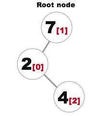
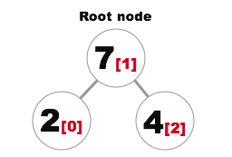

# Union-Find

`Union-Find`是一个数据结构，它记录一个集合的不相交子集的一个划分。`Union-Find`也被乘坐是并查集（disjoint-set）。

我们这么说意味着什么呢？举个例子，`Union-Find`结构能够记录一下几个集合：

```
[a, b, f, k]
[e]
[g, d, c]
```

这些集合互不相交，因为它们没有共同的元素。

`Union-Find`支持三种基本的操作：

1. Find(A)：查找元素A在哪一个子集当中。比如，`find(d)`回返回子集`[g, d, c]`
2. Union(A, B)：将包含元素A和原色B的子集合并到一个子集当中。比如，`union(d, j)`会合并`[g, d, c]`和`i, j`，得到新的子集`[g, d, c, i, j]`。
3. AddSet(A)：添加一个新的子集，该子集只含有元素A。比如，`addSet(h)`添加一个新的子集`[h]`

`Union-Find`最普遍的应用就是记录无向图中连通子集。

# 实现

Union-Find的实现方法有很多，但是我们只采用效率最好的。

```Swift
struct UnionFind<T: Hashable> {
    private var index = [T : Int]()
    private var parent = [Int]()        // parent[i] is the parent's index of node i
    private var size = [Int]()          // size[i] is the size of set i
}
```
我们的Union-Find结构中每一个子集实际上由一棵树来表示。

我们只记录每一个节点的父节点，而不记录每个节点的子节点。我们用一个`parent`数组来记录，`parent[i]`表示节点i的父亲节点。

比如，如果`parent`数组为：

```
parent [1, 1, 1, 0, 2, 0, 6, 6, 6]
	i   0, 1, 2, 3, 4, 5, 6, 7, 8
```

那么树结构就如下图所示：

```
	    1          6
	  /   \       / \
     0     2     7   8
	/ \   /
   3   5 4
```
森林里有两棵树，每一颗树代表一个子集。

我们子集根节点的数字来代表一个子集，在例子中，节点`1`是第一颗树的根，`6`是第二颗树的根。

所以在这个例子中，我们有两个子集，第一个子集用`1`标记，第二个用`6`标记。*Find*操作返回的实际上是每一个子集的标记而不是集合的内容。

注意到一个根节点对应的parent数组的内容是它本身，如`parent[1] = 1`和`parent[6] = 6`，我们利用这个条件来检查一个节点是否是根节点。

# Add集合

我们接下来来看一下几个基本操作的实现，首先是添加一个新的集合。

```Swift
mutating func addSetWith(_ element: T) {
        index[element] = parent.count
        parent.append(parent.count)     // parent[i] = i indicates that node i is the root node
        size.append(1)
    }
```
当添加一个新的元素时，实际上是添加一个新的包含该元素的子集。

1. 我们在index字典中保存元素对应的索引号，以便日后可以快速查找元素。
2. 然后把元素的索引号添加到`parent`数组中，从而新建一棵树。这里，`parent[i]`的值等于元素节点的索引号，即节点为根，因为只有一个节点。
3. `size[i]`表示根节点为`i`的树的节点个数。新建集合对应的值为1，因为只有一个节点。我们将在后面操作中使用`size`数组。

# Find

`Find`通常用来判断一个元素是否包含在某一个子集中。我们的`UnionFind`中的`Find`的实现为`setOf()`：

```Swift
mutating func setOf(_ element: T) -> Int? {
       if let indexOfElement = index[element] {
           return setByIndex(indexOfElement)
       } else {
           return nil
       }
   }
```

首先由`index`字典得到元素的索引号，然后通过一个帮助函数来找到这个元素所在集合：

```Swift
private mutating func setByIndex(_ index: Int) -> Int {
       if parent[index] == index {
           return index
       } else {
           parent[index] = setByIndex(parent[index])
           return parent[index]
       }
   }
```

由于我们处理的是一个树形结构，帮助函数的实现利用了递归操作。

我们说每一个子集由一棵树表示，每棵树又由根节点的索引号唯一表示。所以我们要找到元素所在树的跟节点并返回根节点的索引号即可。

1. 首先，我们判断所给元素是不是根节点，如果是，操作结束。
2. 否则，我们递归地对当前节点的父节点调用该方法。我们做了一件非常重要的事：我们用根节点覆写了当前节点的父亲节点，把当前节点直接改成了根节点的子节点。下一次我们调用这个方法会变得更快，因为从当前节点到根节点的路径变得更短了。没有优化前，这个方法的时间复杂度为O(n)，但是现在接近了O(1)。
3. 我们返回根节点索引号。

下图说明了上述过程。首先树如下所示：



我们调用`setOf(4)`，为了找到根节点，必须先经过节点`2`和节点`7`。

在调用的过程中，树被重新组织成下图所示：



现在如果我们需要再一次调用`setOf(4)`的话，我们不必再先经过节点2而到跟节点了，所以可以看到， Union-Find结构是自我优化的，非常棒。

如下野食一个帮助函数，它检查两个元素是否在同一个子集当中。

```Swift
mutating func inSameSet(_ firstElement: T, and secondElement: T) -> Bool {
        if let firstSet = setOf(firstElement), let secondSet = setOf(secondElement) {
            return firstSet == secondSet
        } else {
            return false
        }
    }
```

因为它调用了`setOf()`，该方法也是自我优化的。

# Union

最后一个操作是*Union*，它将两个子集并成一个更大的集合。

```Swift
mutating func unionSetsContaining(_ firstElement: T, and secondElement: T) {
        if let firstSet = setOf(firstElement), let secondSet = setOf(secondElement) {
            if firstSet != secondSet {
                if size[firstSet] > size[secondSet] {
                    parent[secondSet] = firstSet
                    size[firstSet] += size[secondSet]
                } else {
                    parent[firstSet] = secondSet
                    size[secondSet] += size[firstSet]
                }
            }
        }
    }
```

工作流程如下：

1. 我们找到每一个元素所在集合，我们得到两个整数：各自根节点的索引号
2. 检查两个集合是否为同一个，若是，没有必要合并它们
3. 该步骤是这个操作的优化所在。我们总是想将树的高度保持的越低越好，所以我们总是将更小的树作为另外一颗树的子树。我们通过比较`size`来决定树的大小。
4. 我们将更小的树作为另一颗树的子树。
5. 更新大树的大小

用图示表示这个过程。下图表示在合并前的两个树：


我们调用`unionSetsContaining(4, and 3)`。更小的树被作为子树加到来大树上：


注意到由于我们首先调用了`setOf`，更大的树也被优化了——节点`3`被直接连接到了根节点底下。

优化后的Union操作的时间复杂度也接近O(1)。

# 扩展阅读

[Union-Find at Wikipedia](https://en.wikipedia.org/wiki/Disjoint-set_data_structure)

原文由[Artur Antonov](https://github.com/goingreen)撰写

翻译：[Zach_41](https://github.com/Zach41)

原文链接：[Union-Find](https://github.com/raywenderlich/swift-algorithm-club/blob/master/Union-Find/README.markdown)
